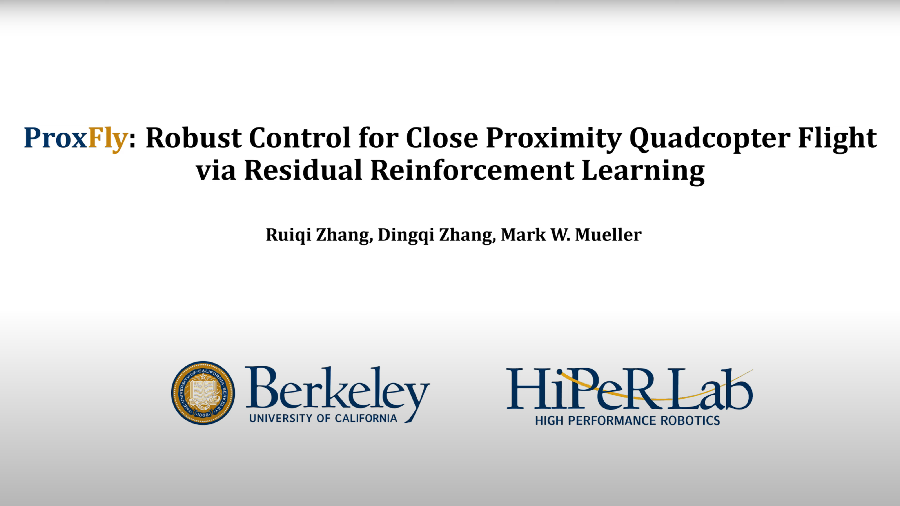

# ProxFly 
Hi there! This is the codebase of our ICRA 2025 paper

[**ProxFly: Robust Control for Close Proximity Quadcopter Flight via Residual Reinforcement Learning**](https://arxiv.org/abs/2409.13193).

The multimedia is also available at Youtube.
[](https://www.youtube.com/watch?v=NhPKgzd3l6w)

## Environment Setup
```
cd ProxFly
bash setup.bash
conda activate proxfly
python3 train.py
```

## Attention
The simulator used in this repo is a simplified version of HiPeR Lab close-source C++ codebase. Hence it's common to get different conclusion from our paper, especially the running time.
For this, we also open the policy network we used for the large quadcopter in the paper at ``./data/model/``

## Citation
If you use this code in an academic context, please cite the following publication:

```
@misc{zhang2024proxfly,
      title={ProxFly: Robust Control for Close Proximity Quadcopter Flight via Residual Reinforcement Learning}, 
      author={Ruiqi Zhang and Dingqi Zhang and Mark W. Mueller},
      year={2024},
      eprint={2409.13193},
      archivePrefix={arXiv},
      primaryClass={cs.RO},
      url={https://arxiv.org/abs/2409.13193}, 
}
```

## Acknowledgement
This work is supported by Hong Kong Center for Logistics Robotics (HKCLR). 

The experimental testbed at the [HiPeR Lab](https://hiperlab.berkeley.edu/members/) is the result of contributions of many people.
